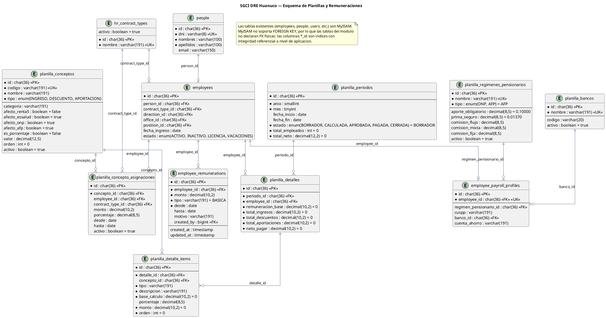

# Esquema de Base de Datos — Módulo Planillas y Remuneraciones

SGCI DRE Huánuco · Laravel 10 · MySQL/MariaDB · `utf8mb4_unicode_ci`

Este documento describe el modelo de datos del módulo de **Planillas**.
Se divide en:

1. **Tablas del módulo (implementadas).**
2. **Tablas reutilizadas** del sistema existente.
3. **Tablas planificadas** (Fases 3–7 del roadmap).

> **Alcance.** Este módulo administra **únicamente el régimen CAS**. Los demás
> regímenes (Nombrado, 276, etc.) los provee **MINEDU** mediante otro sistema, por
> lo que **no se modelan aquí**. En consecuencia, `planilla_periodos` es mensual y
> única: **UNIQUE `(anio, mes)`**.

> **Convenciones**
> - Llaves primarias `UUID` (`char(36)`) salvo tablas legadas.
> - Las tablas existentes (`employees`, `people`, `users`, etc.) usan **MyISAM**,
>   que no soporta *foreign keys*. Por eso las tablas nuevas **no declaran FK**;
>   usan columnas índice (`_id`) con integridad referencial a nivel de aplicación.
> - Las tasas/porcentajes se guardan como decimal (`0.10000` = 10%).

---

## 1. Tablas del módulo (implementadas)

### Diagrama entidad-relación



> Fuente editable en PlantUML: [`database-schema.puml`](database-schema.puml).
> Imágenes generadas: `database-schema.png` y `database-schema.svg`.
>
> Regenerar:
> ```bash
> plantuml -charset UTF-8 -tpng docs/planillas/database-schema.puml
> plantuml -charset UTF-8 -tsvg docs/planillas/database-schema.puml
> ```

---

### 1.1 `employee_remunerations`

Remuneración base del empleado (concepto **"Remuneraciones DL 1057"**) con
vigencia. Permite recalcular planillas históricas sin que un aumento contamine
periodos anteriores.

| Columna | Tipo | Nulo | Default | Notas |
|---|---|---|---|---|
| `id` | char(36) | No | — | PK |
| `employee_id` | char(36) | No | — | → `employees.id` |
| `monto` | decimal(10,2) | No | — | Remuneración base en S/ |
| `tipo` | varchar(191) | No | `BASICA` | Clasificación interna |
| `desde` | date | No | — | Inicio de vigencia |
| `hasta` | date | Sí | NULL | Fin de vigencia (NULL = vigente) |
| `motivo` | varchar(191) | Sí | NULL | Ej. "Incremento DS 327-2025" |
| `created_by` | bigint(20) unsigned | Sí | NULL | → `users.id` |
| `created_at` / `updated_at` | timestamp | Sí | NULL | |

**Índices:** `(employee_id, desde)`, `(created_by)`.

**Regla:** al registrar una nueva vigencia, el servicio cierra la anterior
(`hasta = nueva_desde - 1 día`). Resolución de la vigente:

```sql
WHERE employee_id = ?
  AND desde <= :fecha
  AND (hasta IS NULL OR hasta >= :fecha)
ORDER BY desde DESC LIMIT 1
```

---

### 1.2 `planilla_conceptos`

Catálogo de conceptos. `tipo` mapea 1:1 con las secciones de la boleta.

| Columna | Tipo | Nulo | Default | Notas |
|---|---|---|---|---|
| `id` | char(36) | No | — | PK |
| `codigo` | varchar(191) | No | — | UK · Ej. `DS313_2023` |
| `nombre` | varchar(191) | No | — | Ej. "DS 313-2023" |
| `tipo` | enum | No | — | `INGRESO` · `DESCUENTO` · `APORTACION` |
| `categoria` | varchar(191) | Sí | NULL | `BASE`, `BONIFICACION`, `AFP`, `ONP`, `RENTA`, `TARDANZA`, `ESSALUD`, `OTROS` |
| `afecto_renta5` | tinyint(1) | No | 0 | Afecto a Renta de 5ta |
| `afecto_essalud` | tinyint(1) | No | 1 | Afecto a base EsSalud |
| `afecto_onp` | tinyint(1) | No | 1 | Afecto a base ONP |
| `afecto_afp` | tinyint(1) | No | 1 | Afecto a base AFP |
| `es_porcentaje` | tinyint(1) | No | 0 | `0` = monto fijo, `1` = porcentaje |
| `valor` | decimal(12,5) | Sí | NULL | Monto o tasa por defecto |
| `orden` | int unsigned | No | 0 | Orden en la boleta |
| `activo` | tinyint(1) | No | 1 | Baja lógica |
| `created_at` / `updated_at` | timestamp | Sí | NULL | |

**Índices:** `codigo` (UNIQUE).

**Tipos vs. boleta:** `INGRESO` → *Remuneraciones*; `DESCUENTO` →
*Retenciones/Descuentos*; `APORTACION` → *Aportaciones del Empleador*.

---

### 1.3 `planilla_concepto_asignaciones`

Aplica un concepto a **un empleado** (`employee_id`) o a **todo un régimen**
(`contract_type_id`, p. ej. todos los CAS). El monto/porcentaje aquí definido
sobreescribe el `valor` del catálogo.

| Columna | Tipo | Nulo | Default | Notas |
|---|---|---|---|---|
| `id` | char(36) | No | — | PK |
| `concepto_id` | char(36) | No | — | → `planilla_conceptos.id` |
| `employee_id` | char(36) | Sí | NULL | → `employees.id` |
| `contract_type_id` | char(36) | Sí | NULL | → `hr_contract_types.id` |
| `monto` | decimal(10,2) | Sí | NULL | Monto asignado (S/) |
| `porcentaje` | decimal(8,5) | Sí | NULL | Tasa asignada (0.10000 = 10%) |
| `desde` | date | Sí | NULL | Vigencia opcional |
| `hasta` | date | Sí | NULL | Vigencia opcional |
| `activo` | tinyint(1) | No | 1 | |
| `created_at` / `updated_at` | timestamp | Sí | NULL | |

**Índices:** `pca_concepto_employee_idx (concepto_id, employee_id)`,
`pca_concepto_contract_idx (concepto_id, contract_type_id)`.

---

### 1.4 `employee_payroll_profiles`

Datos de planilla del empleado ("DATOS DEL TRABAJADOR" de la boleta).

| Columna | Tipo | Nulo | Default | Notas |
|---|---|---|---|---|
| `id` | char(36) | No | — | PK |
| `employee_id` | char(36) | No | — | UK · → `employees.id` |
| `regimen_pensionario_id` | char(36) | Sí | NULL | → `planilla_regimenes_pensionarios.id` |
| `cuspp` | varchar(191) | Sí | NULL | Código AFP |
| `banco_id` | char(36) | Sí | NULL | → `planilla_bancos.id` |
| `cuenta_ahorro` | varchar(191) | Sí | NULL | CTA ABONO |
| `created_at` / `updated_at` | timestamp | Sí | NULL | |

**Índices:** `employee_id` (UNIQUE), `regimen_pensionario_id`, `banco_id`.

---

### 1.5 `planilla_regimenes_pensionarios`

Catálogo de regímenes pensionarios con sus tasas.

| Columna | Tipo | Nulo | Default | Notas |
|---|---|---|---|---|
| `id` | char(36) | No | — | PK |
| `nombre` | varchar(191) | No | — | UK |
| `tipo` | enum | No | `AFP` | `ONP` · `AFP` |
| `aporte_obligatorio` | decimal(8,5) | No | 0.10000 | ONP = 0.13000 |
| `prima_seguro` | decimal(8,5) | No | 0.01370 | 1.37% |
| `comision_flujo` | decimal(8,5) | Sí | NULL | Comisión por flujo |
| `comision_mixta` | decimal(8,5) | Sí | NULL | Comisión mixta |
| `comision_fija` | decimal(8,5) | Sí | NULL | Habitat 1.47%, Integra 1.55%, Prima 0% |
| `activo` | tinyint(1) | No | 1 | |
| `created_at` / `updated_at` | timestamp | Sí | NULL | |

**Índices:** `nombre` (UNIQUE).

---

### 1.6 `planilla_bancos`

Catálogo administrable de bancos para la cuenta de abono.

| Columna | Tipo | Nulo | Default | Notas |
|---|---|---|---|---|
| `id` | char(36) | No | — | PK |
| `nombre` | varchar(191) | No | — | UK |
| `codigo` | varchar(20) | Sí | NULL | Ej. `BN`, `BCP` |
| `activo` | tinyint(1) | No | 1 | |
| `created_at` / `updated_at` | timestamp | Sí | NULL | |

**Índices:** `nombre` (UNIQUE).

---

### 1.7 `planilla_periodos`

Periodo mensual de planilla CAS (uno por mes).

| Columna | Tipo | Nulo | Default | Notas |
|---|---|---|---|---|
| `id` | char(36) | No | — | PK |
| `anio` | smallint unsigned | No | — | Año |
| `mes` | tinyint unsigned | No | — | 1–12 |
| `fecha_inicio` | date | Sí | NULL | Inicio del mes |
| `fecha_fin` | date | Sí | NULL | Fin del mes |
| `estado` | enum | No | `BORRADOR` | `BORRADOR` · `CALCULADA` · `APROBADA` · `PAGADA` · `CERRADA` |
| `total_empleados` | int unsigned | No | 0 | Cache del cálculo |
| `total_neto` | decimal(12,2) | No | 0 | Cache del cálculo |
| `created_at` / `updated_at` | timestamp | Sí | NULL | |

**Índices:** `(anio, mes)` (UNIQUE).
**Regla:** solo se (re)genera en `BORRADOR`/`CALCULADA`.
**Fecha de referencia:** la generación resuelve la remuneración y las asignaciones
vigentes al **cierre del periodo** (`fecha_fin`), no al primer día. Así, una
remuneración registrada a mitad de mes (p. ej. `desde = 2026-09-17`) sí aplica a
la planilla de setiembre.

---

### 1.8 `planilla_detalles`

Una fila por empleado dentro de un periodo (snapshots del cálculo).

| Columna | Tipo | Nulo | Default | Notas |
|---|---|---|---|---|
| `id` | char(36) | No | — | PK |
| `periodo_id` | char(36) | No | — | → `planilla_periodos.id` |
| `employee_id` | char(36) | No | — | → `employees.id` |
| `remuneracion_base` | decimal(10,2) | No | 0 | Snapshot de la base vigente |
| `total_ingresos` | decimal(10,2) | No | 0 | Σ items `INGRESO` |
| `total_descuentos` | decimal(10,2) | No | 0 | Σ items `DESCUENTO` |
| `total_aportaciones` | decimal(10,2) | No | 0 | Σ items `APORTACION` |
| `neto_pagar` | decimal(10,2) | No | 0 | Ingresos − descuentos |
| `created_at` / `updated_at` | timestamp | Sí | NULL | |

**Índices:** `employee_id`; UNIQUE `pd_periodo_employee_unique (periodo_id, employee_id)`.

---

### 1.9 `planilla_detalle_items`

Líneas de concepto de un detalle (snapshot por concepto).

| Columna | Tipo | Nulo | Default | Notas |
|---|---|---|---|---|
| `id` | char(36) | No | — | PK |
| `detalle_id` | char(36) | No | — | → `planilla_detalles.id` |
| `concepto_id` | char(36) | Sí | NULL | → `planilla_conceptos.id` |
| `tipo` | varchar(191) | No | — | `INGRESO` · `DESCUENTO` · `APORTACION` |
| `descripcion` | varchar(191) | No | — | Snapshot del nombre del concepto |
| `base_calculo` | decimal(10,2) | No | 0 | Base usada si es porcentaje |
| `porcentaje` | decimal(8,5) | Sí | NULL | Tasa aplicada |
| `monto` | decimal(10,2) | No | 0 | Monto resultante |
| `orden` | int unsigned | No | 0 | Orden en la boleta |
| `created_at` / `updated_at` | timestamp | Sí | NULL | |

**Índices:** `detalle_id`, `concepto_id`.

---

## 2. Tablas reutilizadas

Solo se listan las columnas relevantes para planillas.

| Tabla | Columnas relevantes | Uso en planillas |
|---|---|---|
| `employees` | `id`, `person_id`, `contract_type_id`, `direction_id`, `office_id`, `position_id`, `fecha_ingreso`, `estado` | Sujeto de planilla (se filtra `estado = ACTIVO` y `contract_type = CAS`) |
| `people` | `id`, `dni`, `nombres`, `apellidos`, `email` | Datos personales del empleado |
| `hr_contract_types` | `id`, `nombre` | Régimen (`CAS`, `276`, `Nombrado`, …) |
| `hr_directions`, `hr_offices`, `hr_positions` | `id`, `nombre` | Cargo/dependencia en la boleta |
| `users` | `id` | Trazabilidad (`created_by`) |

> **Integración futura (Asistencias).** Las tablas `horarios`
> (`employees.horario_id` → `horarios.id`) y `marcas_asistencia` se usarán cuando
> se implemente la **automatización** del cálculo de tardanzas (Fase 7). Por
> ahora el registro de tardanzas es **manual** (`planilla_tardanzas`), por lo que
> no se incluyen en el ER ni en la lista de reutilizadas.

---

## 3. Tablas planificadas (Fases 3–7)

> Aún **no implementadas**. Se incluyen para dejar cerrado el diseño.

### 3.1 `planilla_tardanzas`

Registro **manual** de tardanzas/faltas (según la hoja `Dscto. Tard.` del Excel),
almacenado **por empleado y por día** y agregable por periodo/empleado. El monto
se **calcula** a partir de los días/minutos ingresados y la remuneración vigente.

| Columna | Tipo | Nulo | Default | Notas |
|---|---|---|---|---|
| `id` | char(36) | No | — | PK |
| `periodo_id` | char(36) | No | — | → `planilla_periodos.id` |
| `employee_id` | char(36) | No | — | → `employees.id` |
| `fecha` | date | No | — | Día de la falta/tardanza |
| `dias` | smallint unsigned | No | 0 | Días de falta |
| `minutos` | int unsigned | No | 0 | Minutos de tardanza |
| `valor_dia` | decimal(10,2) | No | — | Snapshot `remuneración / 30` |
| `valor_minuto` | decimal(10,4) | No | — | Snapshot `(remuneración / 30) / 480` |
| `monto_dias` | decimal(10,2) | No | 0 | `valor_dia × dias` |
| `monto_minutos` | decimal(10,2) | No | 0 | `valor_minuto × minutos` |
| `total` | decimal(10,2) | No | 0 | `monto_dias + monto_minutos` |
| `origen` | enum | No | `MANUAL` | `MANUAL` · `ASISTENCIA` (Fase 7) |
| `justificado` | tinyint(1) | No | 0 | Excluye del descuento |
| `observacion` | varchar(191) | Sí | NULL | Motivo/justificación |
| `registrado_por` | bigint(20) unsigned | Sí | NULL | → `users.id` |
| `created_at` / `updated_at` | timestamp | Sí | NULL | |

**Índices:** `(periodo_id, employee_id)`, `(employee_id, fecha)`.

**Cálculo:** `PlanillaGenerador` agrupa por periodo/empleado los registros **no
justificados** y emite un `planilla_detalle_items` con el concepto
`FALTAS_TARDANZAS`; la **base imponible = remuneración − Σ total**.

### 3.2 `planilla_boletas`
`id` · `detalle_id` (UNIQUE) · `numero` · `generada_en` · `generada_por` ·
`snapshot json` · timestamps.

### 3.3 Integración con Asistencias (Fase 7 — futura)

Cuando se implemente el módulo de Asistencias, el cálculo de tardanzas se
automatizará sin cambiar el modelo de `planilla_tardanzas`:

- `horarios.tolerancia_min` (columna **nueva**) + `employees.horario_id` definen
  la hora esperada y la tolerancia.
- `marcas_asistencia` (`entrada`, `salida_mediodia`, `retorno_mediodia`, `salida`)
  aporta las marcas reales.
- `planilla_tardanzas.origen = 'ASISTENCIA'` distingue los registros calculados
  de los manuales.

---

## 4. Fórmulas de negocio (referencia — Planilla 0042)

> **AFP/ONP** (según `employee_payroll_profiles.regimen_pensionario_id`) y
> **EsSalud 9%** (aporte del empleador, tope de base 2475) se calculan
> automáticamente en `PlanillaGenerador` (Fase 3). La base afecta surge de los
> flags `afecto_onp`/`afecto_afp`/`afecto_essalud` de cada concepto.
>
> El **descuento por tardanzas** se registra **manualmente** (días/minutos) y el
> sistema calcula el monto con las fórmulas de abajo. La automatización desde
> Asistencias corresponde a la Fase 7.

| Concepto | Fórmula |
|---|---|
| Remuneración base | `employee_remunerations` vigente |
| Valor por día | `remuneración / 30` |
| Valor por minuto | `(remuneración / 30) / 480` (jornada 8 h) |
| Base imponible | `remuneración − faltas/tardanzas` |
| AFP Fondo | `base × 10%` |
| AFP Seguro | `base × 1.37%` |
| AFP Comisión | según `planilla_regimenes_pensionarios.comision_fija` |
| ONP | `base × 13%` |
| Renta 4ta | `base × 8%` |
| EsSalud | `base × 9%` (tope de base 2475) |
| Neto a pagar | `total ingresos − total descuentos` |
